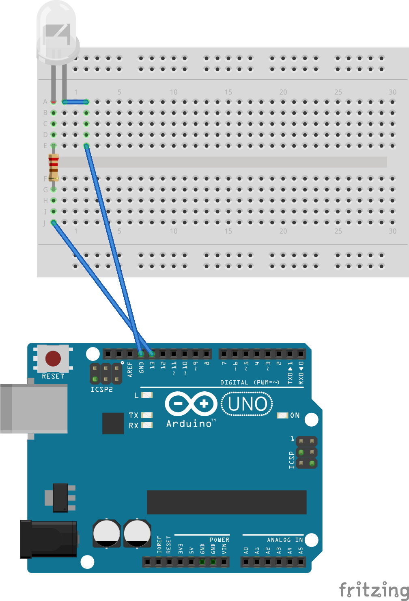

# project1

## Collin Reilly Clark
## 605.715

### Requirements

I am following the project requirements to read keys from the serial console
and flash an LED with the corresponding Morse Code sequence.

I added additional functionality for ease of use to display the received value
and Morse Code sequence on the serial console.

### Diagram



### Code

```rust

#![no_std]
#![no_main]

extern crate panic_halt;
use arduino_uno::prelude::*;
use arduino_uno::hal::port::portb::PB5;
use arduino_uno::hal::port::mode::Output;

const DOT_MS: u16 = 200;
const DASH_MS: u16 = DOT_MS * 3;
const CODES: [&str; 36] = [
                            ".-","-...","-.-.","-..",".","..-.","--.","....",
                            "..",".---","-.-",".-..","--","-.","---",".--.",
                            "--.-",".-.","...","-","..-","...-",".--","-..-",
                            "-.--","--..","-----",".----","..---","...--",
                            "....-",".....","-....","--...","---..","----."
                           ];

#[arduino_uno::entry]
fn main() -> ! {
    let peripherals = arduino_uno::Peripherals::take().unwrap();

    let mut pins = arduino_uno::Pins::new(
        peripherals.PORTB,
        peripherals.PORTC,
        peripherals.PORTD,
    );

    let mut led = pins.d13.into_output(&mut pins.ddr);
    let mut serial = arduino_uno::Serial::new(
        peripherals.USART0,
        pins.d0,
        pins.d1.into_output(&mut pins.ddr),
        57600.into_baudrate(),
    );

    ufmt::uwriteln!(&mut serial, "Hello from Arduino!\r").void_unwrap();

    loop {
        let b = nb::block!(serial.read()).void_unwrap();
        let code = if b <= 122 && b >= 97 {
            // lowercase letters
            CODES[(b - 97) as usize]
        } else if b <= 90 && b >= 65 {
            // uppercase letters
            CODES[(b - 65) as usize]
        } else if b <= 57 && b >= 48 {
            // numbers
            CODES[(b - 48 + 26) as usize]
        } else {
            // invalid -- escape loop
            ufmt::uwriteln!(&mut serial, "Goodbye.\r").void_unwrap();
            panic!();
        };

        ufmt::uwriteln!(&mut serial, "Got {}, blinking {}\r", b as char, code).void_unwrap();
        blink(&mut led, code);
    }
}

fn blink(led: &mut PB5<Output>, code: &str) {
    led.set_low().void_unwrap();
    for i in code.chars() {
        led.set_high().void_unwrap();
        match i {
            '.' => arduino_uno::delay_ms(DOT_MS),
            '-' => arduino_uno::delay_ms(DASH_MS),
            _ => (),
        }
        led.set_low().void_unwrap();
        arduino_uno::delay_ms(DOT_MS);
    }
    arduino_uno::delay_ms(DASH_MS);
}
```

### Video

[https://www.youtube.com/watch?v=SoQZZpzSGko](https://www.youtube.com/watch?v=SoQZZpzSGko)
